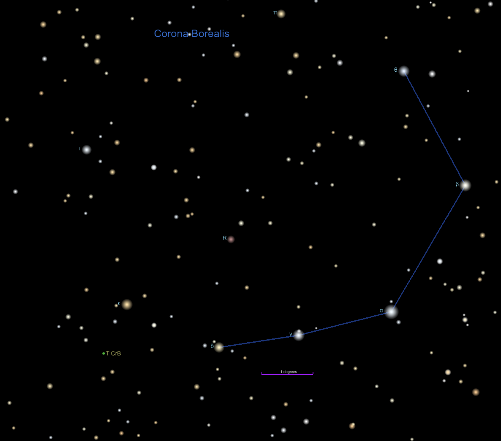
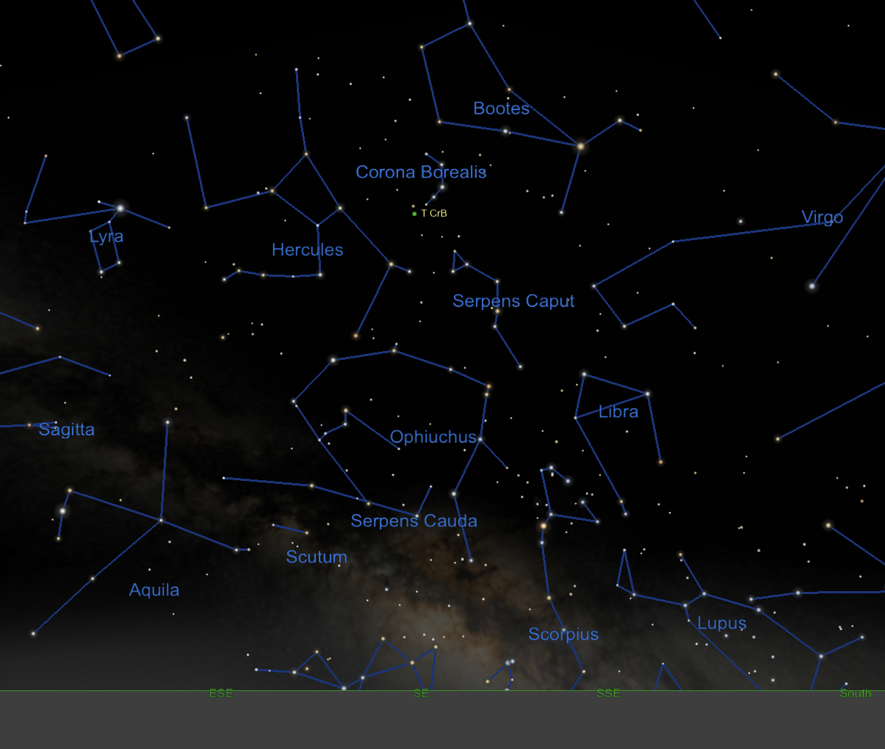

**Welcome to my Gateway**

## [Unicode Text Formatter](https://lingojam.com/BoldTextGenerator)[^51]
[^51]: Handy website to convert plain text for display in *Italics*, **Bold**, and ***Bold Italics***
## [What's that site running? / Netcraft](https://sitereport.netcraft.com/ )[^52]
[^52]: Very useful tool to get information on websites. I use this for gathering information on websites that SPAM me.  • **GoDaddy has a strict policy that prohibits domain names registered with them from sending SPAM.** **[Report domains registered with GoDaddy](https://supportcenter.godaddy.com/AbuseReport/Index?ci=22420)**.  • **Shopify also has a strict policy prohibiting by websites that they host.** **[Report an Issue with a Merchant hosted by Shopify.](https://www.shopify.com/legal/report-aup-violation)**
## [Phone Number Parser Demo for LibPhoneNumber](https://libphonenumber.appspot.com/ )[^53]
[^53]: [google/libphonenumber: Google's common Java, C++ and JavaScript library for parsing, formatting, and validating international phone numbers.](https://github.com/google/libphonenumber )
## [The trusted source for IP address data, leading IP data provider - IPinfo.io](https://ipinfo.io/ )[^54]
[^54]: Geolocate IP Addresses and ownership.
## [URL Expander — Unshorten Any Short URL To A Long URL](https://urlex.org/ )[^56]
[^55]: Get the expanded URL of any shortened URL without clicking on the link.
## [GitHub Status](https://www.githubstatus.com/ )[^55]
[^56]: Status Check of [GitHub](https://www.github.com/)

Expand/Collapse: Stellar Explosion Visible Until September 2024

## Stellar Explosion 

A conceptual image of how to find Hercules and his mighty globular clusters in the sky created using a planetarium software. Look up after sunset during summer months to find Hercules! Scan between Vega and Arcturus, near the distinct pattern of Corona Borealis. Once you find its stars, use binoculars or a telescope to hunt down the globular clusters M13 and M92. If you enjoy your views of these globular clusters, you’re in luck – look for another great globular, M3, in the nearby constellation of Boötes. Credit: NASA

| Stellar Explosion | Visibility | Location |
|---|---|---|
| • **[A Giant Explosion in Space Will Happen This Year, And You Can See It : ScienceAlert](https://www.sciencealert.com/a-giant-explosion-in-space-will-happen-this-year-and-you-can-see-it )** (08 April 2024) • **[Astrophysicist explains science behind once-in-a-lifetime nova outburst that will light up the sky this year](https://phys.org/news/2024-03-astrophysicist-science-lifetime-nova-outburst.html )** (MARCH 19, 2024) • **[Once-in-a-Lifetime Viewing Opportunity: Nova Explosion, ‘New’ Star in Northern Crown](https://scitechdaily.com/once-in-a-lifetime-viewing-opportunity-nova-explosion-new-star-in-northern-crown/ )** (FEBRUARY 28, 2024) • **[NASA — View Nova Explosion, ‘New’ Star in Northern Crown – Watch the Skies](https://blogs.nasa.gov/Watch_the_Skies/2024/02/27/view-nova-explosion-new-star-in-northern-crown/ )** (February 27, 2024) | 2024-03-16 (now) — 2024-09 (September) 
| Corona Borealis constellation, lying in a semicircular pattern between the Bootes and Hercules constellations  |
| Star explosion in the Corona Borealis constellation  This event, set to occur this year, will see T CrB lighting up the Corona Borealis constellation, shining as brightly as the famed North Star, Polaris, for approximately one week.  The exact timing of this stellar spectacle remains uncertain, with NASA forecasting its occurrence sometime between now and September. T CrB is nestled within the Corona Borealis constellation, lying in a semicircular pattern between the Bootes and Hercules constellations. | | |

 

## Briefly About Me \| [\[ Details About Me \]](https://ralphhightower.github.io/RalphHightower/)

[Follow me on LinkedIn: https://linkedin.com/comm/mynetwork/discovery-see-all?usecase=PEOPLE_FOLLOWS&followMember=ralphhightower](https://linkedin.com/comm/mynetwork/discovery-see-all?usecase=PEOPLE_FOLLOWS&followMember=ralphhightower)

### Personality Tests

|  Test/Website | Result |
|---|---|
| [Top Gun Call Sign](http://www.topgunday.com/call-sign-generator/) | Lt. Ralph 'Tahoe' Hightower[^11] |
| [Myers-Briggs Personality Test®](https://www.myersbriggs.org/my-mbti-personality-type/mbti-basics/) | [INTP](https://www.mbtionline.com/en-US/MBTI-Types/INTP)[^12] |
| [CliftonStrength 34™](https://www.gallup.com/cliftonstrengths/en/253868/popular-cliftonstrengths-assessment-products.aspx) | Ideation \| Deliberative \| Learner \| Input \| Strategic Leaders with great Strategic Thinking strengths are the ones who keep us all focused on what could be. They are constantly absorbing and analyzing information and helping the team make better decisions. People with strength in this domain continually stretch our thinking for the future. |
| [Game of Thrones Personality Test](https://mygotcharacter.com/)[^13] | Primary Character: [Mance Rayder](https://mygotcharacter.com/EKJKKKCKIACFCK.html)[^14] Secondary Character:  [Ser Jaime Lannister](https://mygotcharacter.com/EKJKKKCKIACFCK.html)[^15] Tertiary Character: [Ygritte](https://mygotcharacter.com/EKJKKKCKIACFCK.html)[^16] |

[^11]: I'm a [Chevy](https://www.chevrolet.com/) guy and Tahoe is a model name. I love it!
[^12]: People with INTP preferences are quiet, thoughtful, and analytical. They tend to put a great deal of consideration into everything they do. INTPs are generally easygoing and genuine. They might seem to “zone out” from time to time while they consider new concepts or explore how something works. They are often happiest laying low and working hard behind the scenes. While they may seem impersonal with people they don’t know well, they like to have a close group of people they open up to. They are naturally adept at building structural models or coming up with new concepts for solving problems. They tend to see the world as a system that can be analyzed, and this is how they approach just about everything in life. • 4.8% of the population • 5.8% of men • 4.0% of women • × analytical × conceptual × logical × × quiet × independent × easygoing × × complex × driven × curious × × questioning × methodical × values competence × × self-critical × thoughtful × innovative × × problem solver × reflective × autonomous ×
[^13]: I had to Google the GOT Personality Test. Oh, I don't subscribe to HBO, so all I know of Game of Thrones is that's it's sorta like King Arthur set in medieval times. I took the GOT Personality Test. I saw that reference in a LinkedIn news article about using personality tests to get the right balance of different personalities. I think using a personality test to determine employment is a form of discrimination and I use that rather strictly because there's race discrimination and gender discrimination.
[^14]: Primary Character: Mance Rayder  Nickname: King Beyond the Wall Traits: Inspiring, Formidable, Pioneer Your primary character is Mance Rayder. You are a charismatic, calm, and determined man with strong leadership qualities. You tend to rise quickly through the ranks of any organization you enter. You have good social and diplomatic skills, allowing you to collaborate with many different types of people. You have an honest yet stern persona which earns you respect and admiration of those around you. You are very trusting which can be your greatest weakness. You value freedom above all else.
[^15]: Secondary Character: Ser Jaime Lannister Nickname: The Kingslayer Traits: Arrogant, Sarcastic, Apathetic Your secondary character is Ser Jaime Lannister. You are charming and capable of impeccable politeness in the right circumstances. In the wrong circumstances, others perceive you to be disdainful, sarcastic and arrogant. However your arrogance may just be confidence, as you excel in a number of areas, including intelligence. You don't mock others over minor failings but you are usually very blunt. You typically just say what you are thinking without regard to the feelings of those that you perceive as incompetent. You regard ruthlessness as a virtue and behave in an unapologetically amoral way. You're not politically ambitious and sly maneuvering is not your way.
[^16]: Tertiary Character: Ygritte Nickname: Ygritte Traits: Wild, Uncoventional, Determined Your tertiary character is Ygritte. You are brave and unconventional. You have a mind of your own and prefer not to conform with the demands of societu're cunning and value freedom above all else. You're loyal, but also very passionate and you follow to your heart much more than your head. You live a very fulfilled life, chasing your dreams but this sometimes causes others to mistrust you although you have little enmity in your heart.

I freeze time; I photograph. I have 50++ years of computer programming and software development; most recently using C# and .Net. Athough I am retired from software development as a vocation, I am still active for personal projects. I have witnessed two final space flights: the US half of the Apollo/Soyuz Test Project, and Space Shuttle STS-135 Atlantis with the Final Four \[CDR Chris Ferguson, PLT Doug Hurley, MS1 Sandra Magnus, MS2 Rex Walheim\], as well as the final landing next to the control tower of the Shuttle Landing Facility (200 yards from the runway).

Photography is another creative endeavor that I have enjoyed since 1980. My first camera was the Canon A-1 which was an innovative camera for the 80's, which I still use. I added one of my bucket list cameras in July 2013, a Canon New F-1 with the AE Finder FN and the AE Motor Drive FN. December 2013, I added a DSLR, the Canon 5D Mark III with the EF 24-105mm f4L. I enjoy photography period. It doesn't matter if I am shooting film or digital. 

### Where I Can Be Found 

| Content | Website |
|---------|---------|
| CodeProject | [RalphHightower](https://www.codeproject.com/Members/RalphHightower) |
| Facebook | [RalphHightower](https://www.facebook.com/ralph.hightower/) (I spend more time on LinkedIn than I do on Facebook.) |
| GitHub | **[RalphHightower (Ralph Hightower\)](https://github.com/RalphHightower)** |
| GitLab | [RalphHightower](https://gitlab.com/RalphHightower) |
| GitLab | [Permanent Vacations](https://gitlab.com/permanent-vacations) |
| Google Dev | [RalphHightower](https://g.dev/RalphHightower) |
| Gravatar | [RalphHightower](http://gravatar.com/ralphhightower) |
| Hackster.io | [ralph-hightower](https://www.hackster.io/ralph-hightower) |
| IEEE Collabratec | [RalphHightower](https://ieee-collabratec.ieee.org/app/p/RalphHightower) |
| LinkedIn Profile | **[RalphHightower](https://www.linkedin.com/in/ralphhightower/)** (LinkedIn is where I spend the majority of my time.) |
| Photography Portfolio \(Flickr\) | **[RalphHightower](https://www.flickr.com/photos/ralphhightower/)** |
| Stack Overflow | [ralph-hightower](https://stackoverflow.com/users/19978043/ralph-hightower) |
| Twitter | ~~[RalphHightower](https://twitter.com/RalphHightower)~~[^21]|
| YouTube | [RalphHightower](https://www.youtube.com/@RalphHightower&show_icons)  |

[^21]: As of April 27, 2023, I deactivated my Twitter account based on this Elon Musk tweet: [@ElonMusk](https://twitter.com/elonmusk/status/1651602599345373186): *Anyone making materially false statements on this platform will get Community Noted, including you, me, Tucker, advertisers, head of state, etc. No exceptions.  Convince the people and let the chips fall where they may.*  @RalphHightower: Seriously? Yet you welcomed back a pathological liar, Donald Trump, who incited and welcomed violence in an attempted coup d'état on January 6 in the storming of the U.S. Capitol. Twitter has gone to ***HELL!***

### Authored Websites 

|[RalphHightower](https://ralphhightower.github.io/RalphHightower/) | Description |
|---|---|
| [RalphHightower](https://ralphhightower.github.io/RalphHightower/) GitHub Repositories | Primary Website|
| [Azure-Resources](https://ralphhightower.github.io/Azure-Resources/ )|Useful Documents for Azure|
| [GM-Canada-OnStar-2G-Sunset](https://ralphhightower.github.io/GM-Canada-OnStar-2G-Sunset/ )|Canada sunsetted cellular CDMA 2G technology in 2015. GM Canada figured out how to retain OnStar functionality in affected vehicles without using a dongle like GM USA. Documents from [NHTSA (US) nhtsa\.gov](https://www.nhtsa.gov).|
| [JekyllTestBed](https://ralphhightower.github.io/JekyllTestBed/ ) | Test Bed for Experimentation with Jekyll. |
| [Sushi](https://ralphhightower.github.io/Sushi/ ) | A place for sushi recipes and checklists for checking off menu items. |
| [NANPATelephoneFormatDetection](https://ralphhightower.github.io/NANPATelephoneFormatDetection/ )|North American Numbering Plan|
| [SpaceShuttleMissionSchedule](https://ralphhightower.github.io/SpaceShuttleMissionSchedule/ )[^31]|NASA Space Shuttle Mission Schedule Transfer to Outlook Calendar|
| [RalphHightower/minimaUSCGamecockSandstorm](https://ralphhightower.github.io/minimaUSCGamecockSandstorm/USCGamecocksSandstorm.html) | USC Gamecock Sandstorm theme derived from [jekyll](https://github.com/jekyll/jekyll ) / [minimaa](https://github.com/jekyll/minima), a one-size-fits-all Jekyll theme for USC Gamecock writers. **[Production Ready]** |

[^31]: Support ended with wheelstop of Space Shuttle Atlantis on July 21, 2011 with the end of the Space Shuttle fleet. 

### [USC Gamecocks](https://www.sc.edu/)

| [USC — University of South Carolina](https://www.sc.edu) |
|---|
| [USC — College of Engineering and Computing](https://sc.edu/study/colleges_schools/engineering_and_computing/index.php) |
| [USC Alumni Association](https://uofscalumni.org/) |
| [USC Gamecock Sports](https://gamecocksonline.com/) |
| [WUSC-FM 90.5 FM](https://garnetgate.sa.sc.edu/organization/wuscfm)[^61] |
| [Carolina Band](https://sc.edu/study/colleges_schools/music/ensembles/usc_bands/athletic_bands/carolina_band/index.php)  |
| [University Band](https://sc.edu/study/colleges_schools/music/ensembles/usc_bands/concert_bands/university_band.php) |
| [Jazz Bands](https://sc.edu/study/colleges_schools/music/ensembles/jazz_ensembles/index.php) |

[^61]: WUSC-FM was an AM Radio 📻 broadcast station when I was a student. 

## [NOAA / NWS Space Weather Prediction Center](https://www.spaceweather.gov/homepage )

## [Malfunction Junction Revamp](https://www.scdotcarolinacrossroads.com/)[^41]

[^41]: [South Carolina Department of Transportation](https://www.scdot.org/) DOT prefers that this massive revamp project to minimize the wrecks and traffic jams at the junctions of I-26, I-20, and I-126 be called *"Carolina Crossroads"*.

## [South Carolina Electric Cooperatives Outages Map](https://outages.ecsc.org/outages/maps)

|   |
|---|
| |
|  |
|  |

|    |    |
|---|---|
|  |  |
|  |  |

|    |
|---|
|  |
